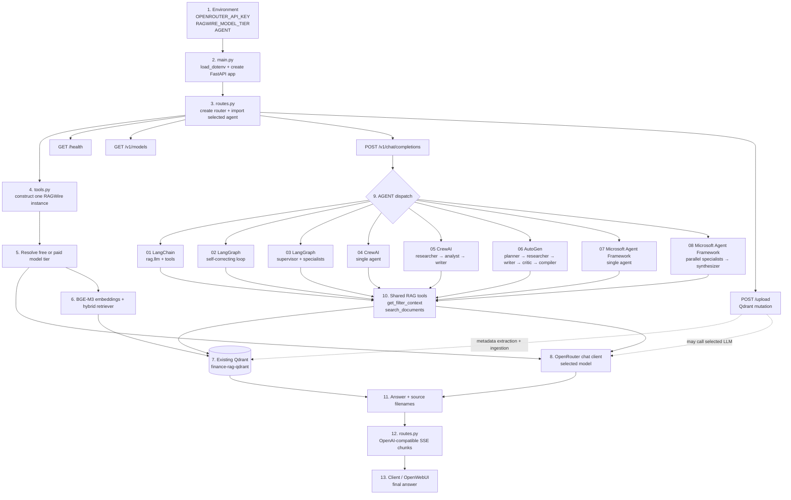

# FastAPI RAG Backend: Complete Tutorial and Test Guide

This lesson exposes RAGWire through an OpenAI-compatible FastAPI API. It is a
backend service, not a Chainlit application. A separate frontend can call its
HTTP endpoints, and the `AGENT` environment variable selects one of eight agent
implementations at process startup.

> **Use this service locally unless you add security first.** The current code
> has no authentication, allows broad CORS access, exposes document ingestion,
> and returns internal exception text in the chat stream. It is a teaching
> backend, not a production-ready public API.

## 1. What you will build and test

By the end of this guide, you will be able to:

1. Start the existing local Qdrant database safely.
2. Select the free or paid OpenRouter model tier explicitly.
3. Run the FastAPI backend with any of the eight agent implementations.
4. Inspect health and model-discovery endpoints.
5. Send an OpenAI-compatible streaming chat request.
6. Test retrieval without changing Qdrant data.
7. Run deterministic tests without making LLM calls.
8. Understand which operations mutate data or may incur API charges.

## 2. Directory structure

```text
06 FastAPI RAG Backend/
├── main.py                         # Creates and starts the FastAPI app
├── routes.py                       # Health, model, chat, and upload endpoints
├── tools.py                        # One process-level RAGWire instance and tools
├── agents/
│   ├── 01_langchain_agent.py
│   ├── 02_langgraph_self_correcting_agent.py
│   ├── 03_langgraph_supervisor_agent.py
│   ├── 04_crewai_agent.py
│   ├── 05_crewai_multiagent.py
│   ├── 06_autogen_agent.py
│   ├── 07_microsoft_agent.py
│   ├── 08_microsoft_multiagent.py
│   └── stream_filter.py
├── model_tier_config/
│   ├── config/
│   │   └── config_openrouter_qdrant.yaml
│   └── metadata/
│       └── finance_metadata.yaml
└── tests/
    ├── test_model_tier_wiring.py
    └── test_stream_filter.py
```

The active runtime config is:

```text
model_tier_config/config/config_openrouter_qdrant.yaml
```

Do not confuse it with the older files under `config/`. `tools.py` is the
source of truth for the active path.

## 3. Runtime architecture

```text
HTTP client / OpenWebUI
          |
          v
      main.py
          |
          v
      routes.py ------ AGENT env var ------> agents/01 ... agents/08
          |                                      |
          +------------------+-------------------+
                             v
                         tools.py
                             |
                one tier-selected RAGWire instance
                             |
              +--------------+---------------+
              |                              |
              v                              v
       OpenRouter chat model          local Qdrant
       free or paid tier              finance-rag-qdrant
```

The key design rule is that the process selects one model tier once:

```python
MODEL_TIER = os.getenv("RAGWIRE_MODEL_TIER", "free")
rag = RAGWire(CONFIG_PATH, model_tier=MODEL_TIER)
SELECTED_MODEL_ID = rag.config["llm"]["model"]
```

- LangChain and LangGraph agents reuse `rag.llm`.
- CrewAI adds its required `openrouter/` prefix to `SELECTED_MODEL_ID`.
- AutoGen and Microsoft Agent Framework receive `SELECTED_MODEL_ID` directly.
- No agent may silently switch from the free tier to the paid tier.

## Overall step-by-step flow

The complete runtime path is shown below. It includes startup, router dispatch,
all eight agents, shared RAG tools, Qdrant retrieval, OpenRouter generation, and
the streamed response returned to the client.



### Sequence in plain language

1. **Environment:** load `OPENROUTER_API_KEY`, `RAGWIRE_MODEL_TIER`, and
   `AGENT`. A value in `.env` can select an agent unless the shell overrides it.
2. **Application:** `main.py` creates FastAPI and starts Uvicorn on port `8080`.
3. **Router:** `routes.py` imports one `agents/*.py` module and registers the
   health, model, chat, and upload endpoints.
4. **Shared pipeline:** `tools.py` constructs one RAGWire instance, resolves the
   tier, initializes embeddings, loads finance metadata, and connects to Qdrant.
5. **Chat dispatch:** `/v1/chat/completions` passes messages to the selected
   agent's `stream()` function.
6. **Agent workflow:** the chosen LangChain, LangGraph, CrewAI, AutoGen, or
   Microsoft workflow decides when to call the shared retrieval tools.
7. **Retrieval:** `search_documents` queries the existing finance collection;
   `get_filter_context` supplies metadata/filter guidance.
8. **Generation:** the selected OpenRouter model produces the answer. LangChain
   and LangGraph use `rag.llm`; the other adapters use the same model ID.
9. **Streaming:** `routes.py` wraps answer fragments as SSE and terminates with
   `data: [DONE]` for OpenWebUI or another OpenAI-compatible client.
10. **Upload exception:** `/upload` is a separate mutation path that can call
    metadata extraction and write Qdrant points. It is not a read-only test.

## 4. Model tiers

The active config defines:

| Tier | OpenRouter model | Cost behavior |
|---|---|---|
| `free` | `nvidia/nemotron-3-super-120b-a12b:free` | No paid fallback; subject to free capacity and rate limits |
| `paid` | `nex-agi/nex-n2-mini` | Requests can consume OpenRouter credit |

Select a tier before starting the backend:

```bash
export RAGWIRE_MODEL_TIER=free
```

Use the paid tier only as a deliberate choice:

```bash
export RAGWIRE_MODEL_TIER=paid
```

> **Privacy warning:** the NVIDIA free endpoint may log prompts. Use only public
> or non-sensitive documents and questions. Never use a hidden paid fallback to
> work around free-tier rate limits.

Changing the chat-model tier does not change embeddings and does not require a
new Qdrant collection. Vector compatibility is controlled by the embedding
model, not the chat model.

## 5. Data and retrieval configuration

The module currently uses:

| Setting | Value |
|---|---|
| Embedding model | `BAAI/bge-m3` |
| Dense vector size | `1024` |
| Dense distance | cosine |
| Sparse retrieval | enabled |
| Qdrant URL | `http://localhost:6333` |
| Collection | `finance-rag-qdrant` |
| Search type | hybrid |
| Default `top_k` | `5` |
| Recreate collection | `false` |
| Metadata fail-fast | `true` |

The finance metadata schema extracts:

- `company_name`
- `doc_type`
- `fiscal_year`
- `fiscal_quarter`

`fail_on_extraction_error: true` prevents a failed metadata extraction from
silently writing chunks that cannot be filtered correctly.

## 6. Prerequisites

You need:

- Python 3.12 or newer;
- Docker Desktop or another working Docker engine;
- the repository environment under `.venv`;
- an OpenRouter API key; and
- the dependencies required by the agent you want to test.

Move into the lesson directory:

```bash
cd "/Users/adnan/Documents/adnanedu/udemy/AI/ragwire/ragwire/06 FastAPI RAG Backend"
```

Check Python:

```bash
../.venv/bin/python --version
```

Check the core imports:

```bash
../.venv/bin/python -c "import fastapi, uvicorn, ragwire; print(ragwire.__file__)"
```

The printed RAGWire path should resolve to the canonical repository package:

```text
.../ragwire/ragwire/__init__.py
```

It must not resolve to a copied package inside this lesson.

### Dependency warning

The repository currently relies on some transitive or manually installed
packages. In particular, this backend directly uses FastAPI, Uvicorn,
`python-multipart`, sentence-transformers through `HuggingFaceEmbeddings`, and
optionally Microsoft Agent Framework. A clean environment may therefore need:

```bash
uv pip install \
  fastapi \
  uvicorn \
  python-multipart \
  sentence-transformers
```

For agents `07` and `08`, also install:

```bash
uv pip install agent-framework-openai
```

Do not blindly run `uv sync` on an environment containing additional lesson
dependencies. At the time this guide was written, `uv sync --check` reported
that syncing would uninstall 16 packages, including sentence-transformers and
its runtime stack. Review that proposed change before accepting it.

## 7. Configure environment variables

For macOS or Linux:

```bash
export OPENROUTER_API_KEY="your-openrouter-key"
export QDRANT_API_KEY=""
export RAGWIRE_MODEL_TIER=free
export AGENT=01_langchain_agent
```

For PowerShell:

```powershell
$env:OPENROUTER_API_KEY = "your-openrouter-key"
$env:QDRANT_API_KEY = ""
$env:RAGWIRE_MODEL_TIER = "free"
$env:AGENT = "01_langchain_agent"
```

Do not put a real key in source code or commit it to Git. The local Qdrant
instance does not normally require an API key, so the empty value is
intentional.

The config ignores `QDRANT_URL` because it explicitly targets localhost. This
prevents a cloud URL in `.env` from silently redirecting the lesson to a
different database.

## 8. Start and verify local Qdrant

First run the read-only health probe from the lesson directory:

```bash
../.venv/bin/python ../scripts/check_qdrant.py
```

Expected result:

```text
Local Qdrant is healthy
```

Inspect the existing collection without changing it:

```bash
curl --fail --silent \
  http://localhost:6333/collections/finance-rag-qdrant \
  | ../.venv/bin/python -m json.tool
```

Confirm that:

- status is green;
- the dense vector size is `1024`;
- distance is `Cosine`; and
- sparse vector configuration exists.

If Qdrant is not running, inspect `../start_qdrant.sh` before executing it:

```bash
../start_qdrant.sh
```

That script can pull an image, stop or replace a container, create a persistent
volume, and migrate legacy container-local storage. It is designed to preserve
data, but it is not a read-only command. Do not delete any retained recovery
container until collection health and retrieval have been verified.

## 9. Run deterministic tests first

These tests do not contact OpenRouter or Qdrant:

```bash
../.venv/bin/python -m unittest tests.test_model_tier_wiring -v
```

They verify:

- the missing tier defaults to `free`;
- explicit `free` and `paid` values reach `RAGWire`;
- paid selection is tested without sending a paid request;
- the canonical tier mapping is present;
- the local collection settings are preserved; and
- every agent uses the process-selected model.

Compile the backend:

```bash
../.venv/bin/python -m compileall -q main.py routes.py tools.py agents tests
```

Search for stale competing model selectors:

```bash
rg -n \
  'OPENROUTER_MODEL_ID|CREWAI_MODEL_ID|OPENAI_BASE_URL|ChatOpenAI\(' \
  main.py routes.py tools.py agents model_tier_config
```

No runtime agent should match. A test literal that checks for forbidden strings
is not configuration drift.

### Known test failures

Running the complete lesson suite currently produces three unrelated failures
in `test_stream_filter.py`. The tier-specific suite passes. Do not falsely
interpret the full suite as green until those stream-filter defects are fixed.

The root repository metadata-extractor suite also currently has two unrelated
failures. Those failures are outside this lesson's model-tier wiring.

## 10. Start the FastAPI backend

Start with the simplest agent:

```bash
export RAGWIRE_MODEL_TIER=free
export AGENT=01_langchain_agent
../.venv/bin/python main.py
```

The server listens on:

```text
http://localhost:8080
```

The comment at the top of `main.py` mentions port `8000`, but the executable
code uses port `8080`. Use `8080` unless you change `uvicorn.run(...)`.

FastAPI's automatic documentation is available at:

- Swagger UI: <http://localhost:8080/docs>
- ReDoc: <http://localhost:8080/redoc>
- OpenAPI JSON: <http://localhost:8080/openapi.json>

To use the Uvicorn CLI instead of the `main.py` launcher:

```bash
../.venv/bin/uvicorn main:app --host 127.0.0.1 --port 8080
```

Avoid `--reload` while testing expensive startup. Reload mode may initialize
the embedding model and RAG pipeline more than once.

## 11. Test the HTTP endpoints

Use a second terminal for the following commands.

### 11.1 Health

```bash
curl --fail --silent http://localhost:8080/health
```

Expected response:

```json
{"status":"ok"}
```

This proves that FastAPI is responding. It does not prove that the selected
model can call tools successfully.

### 11.2 List exposed agent models

```bash
curl --fail --silent http://localhost:8080/v1/models \
  | ../.venv/bin/python -m json.tool
```

For agent `01`, the response should contain:

```json
{
  "id": "ragwire-agent",
  "object": "model",
  "owned_by": "ragwire"
}
```

This `id` identifies the loaded agent API, not the underlying OpenRouter model.

### 11.3 Get one model record

```bash
curl --fail --silent \
  http://localhost:8080/v1/models/ragwire-agent \
  | ../.venv/bin/python -m json.tool
```

Be aware that the current route echoes any requested model ID and does not
validate that it exists. Treat `/v1/models` as the authoritative discovery
endpoint.

### 11.4 Send a streaming chat request

Use public, non-sensitive test content:

```bash
curl --no-buffer --request POST \
  http://localhost:8080/v1/chat/completions \
  --header 'Content-Type: application/json' \
  --data '{
    "model": "ragwire-agent",
    "messages": [
      {
        "role": "user",
        "content": "Using the documents, report Apple Inc. fiscal 2024 revenue and cite the source."
      }
    ]
  }'
```

The response uses Server-Sent Events (SSE):

```text
data: {"id":"chatcmpl-...","object":"chat.completion.chunk",...}

data: {"id":"chatcmpl-...","choices":[{"delta":{"content":"..."}}]}

data: [DONE]
```

The request's `model` field does not select the underlying LLM. The running
process already selected the agent through `AGENT` and the LLM through
`RAGWIRE_MODEL_TIER`.

Check all of the following before calling the smoke test successful:

1. the stream ends with `[DONE]`;
2. the response contains facts retrieved from documents;
3. a source filename is cited;
4. no raw tool-call JSON leaks into the answer; and
5. the server log contains no provider or tool-schema exception.

The route catches agent exceptions and emits them inside a successful HTTP
stream. Therefore, HTTP status `200` alone is not proof of success. Search the
stream for `[Error:`.

## 12. Test each agent implementation

An agent is imported once when the process starts. Stop the server with
`Ctrl+C`, change `AGENT`, and restart for every test.

| `AGENT` value | Framework | Design | Expected relative LLM usage |
|---|---|---|---|
| `01_langchain_agent` | LangChain | Single tool-calling agent | Low |
| `02_langgraph_self_correcting_agent` | LangGraph | Retrieval, generation, query rewrite loop | Medium |
| `03_langgraph_supervisor_agent` | LangGraph | Supervisor plus specialists | High |
| `04_crewai_agent` | CrewAI | Single tool-calling agent | Medium |
| `05_crewai_multiagent` | CrewAI | Researcher, analyst, writer | High |
| `06_autogen_agent` | AutoGen | Five-agent round-robin report workflow | Very high |
| `07_microsoft_agent` | Microsoft Agent Framework | Single tool-calling agent | Medium |
| `08_microsoft_multiagent` | Microsoft Agent Framework | Four parallel specialists plus synthesis | Very high |

Example restart:

```bash
export AGENT=04_crewai_agent
export RAGWIRE_MODEL_TIER=free
../.venv/bin/python main.py
```

Then repeat the health, model-list, and streaming chat tests.

Record a small matrix while testing:

| Agent | Tier | Selected model | Retrieval worked | Tool call worked | Stream clean | Failure class |
|---|---|---|---|---|---|---|
| `01_langchain_agent` | `free` | Nemotron | | | | |
| `04_crewai_agent` | `free` | Nemotron | | | | |
| `06_autogen_agent` | `free` | Nemotron | | | | |
| `07_microsoft_agent` | `free` | Nemotron | | | | |

At minimum, perform a real tool-call smoke test once per framework. LangChain
success does not prove CrewAI, AutoGen, or Microsoft Agent Framework
compatibility. If the free model fails a tool schema, report that adapter as
incompatible. Do not silently switch to the paid tier.

Multi-agent implementations can generate many requests for a single user
question. This matters on both rate-limited free endpoints and billable paid
endpoints.

## 13. Agent behavior in detail

### Agent 01: LangChain

- Creates one LangChain agent with `rag.llm`.
- Exposes `get_filter_context` and `search_documents` as tools.
- Suppresses tool-call chunks and streams only answer text.
- Best first smoke test because it has the smallest architecture.

### Agent 02: self-correcting LangGraph

- Retrieves context directly through `rag`.
- Generates an answer when context exists.
- Rewrites the query and retries up to three iterations when retrieval fails.
- Uses `rag.llm` for generation and rewriting.

### Agent 03: LangGraph supervisor

- Routes work among financial, legal-risk, technical, and summary specialists.
- Each specialist retrieves focused context.
- A final synthesis node combines the specialist results.
- More LLM calls means more latency and rate-limit exposure.

### Agent 04: CrewAI single agent

- Wraps the selected ID as `openrouter/<selected-model>` for CrewAI.
- Uses both finance retrieval tools.
- Tries to strip reasoning and raw tool traces from final output.
- Free-tier tool compatibility must be tested, not assumed.

### Agent 05: CrewAI multi-agent

- Runs researcher, analyst, and writer roles sequentially.
- Only the researcher receives retrieval tools.
- Streams writer output as the final response.

### Agent 06: AutoGen

- Runs planner, researcher, writer, critic, and compiler agents.
- Declares function calling and JSON output capabilities to the model client.
- The researcher receives the RAG tools.
- Stops on `TERMINATE` or after the configured message limit.

### Agent 07: Microsoft Agent Framework

- Creates one tool-calling agent.
- Uses the selected OpenRouter model ID without a separate model default.
- Requires the optional `agent-framework-openai` dependency.

### Agent 08: Microsoft multi-agent workflow

- Fans the query out to four specialists in parallel.
- Collectors store each response in shared workflow state.
- An aggregator waits for all four outputs.
- A synthesizer produces the final answer.
- See `agents/08_microsoft_multiagent.md` for a deeper workflow walkthrough.

## 14. Test retrieval directly without an LLM answer

This test reads the existing collection but does not ingest or delete data:

```bash
export RAGWIRE_MODEL_TIER=free

../.venv/bin/python -c '
from tools import rag
docs = rag.retrieve("Apple Inc. fiscal 2024 revenue", top_k=3)
print(f"documents={len(docs)}")
for doc in docs:
    print(doc.metadata.get("file_name", "unknown"))
'
```

This still initializes the OpenRouter chat client, but `rag.retrieve(...)`
should not send a chat-completion request when `auto_filter` is false and no
filter extraction is requested.

## 15. Test document upload only when mutation is intended

The upload endpoint is not a harmless API smoke test. It performs ingestion,
which can:

- call the metadata-extraction LLM;
- send document content to the selected endpoint;
- create new Qdrant points;
- update the existing collection; and
- incur cost when `RAGWIRE_MODEL_TIER=paid`.

Before uploading:

1. use only public, non-sensitive documents on the free endpoint;
2. confirm the target collection is `finance-rag-qdrant`;
3. confirm `force_recreate` is `false`;
4. record existing point counts and file hashes; and
5. obtain explicit approval for the mutation.

Only then run an upload test:

```bash
curl --request POST \
  http://localhost:8080/upload \
  --form 'files=@/absolute/path/to/public-sec-filing.pdf'
```

There is no dry-run mode on this route. Do not execute it merely to prove that
FastAPI accepts multipart forms.

The route also trusts the uploaded filename when constructing a temporary path.
That is another reason not to expose this endpoint to untrusted users without
filename sanitization and authentication.

## 16. Connect OpenWebUI

OpenWebUI should point to the OpenAI-compatible API base:

```text
http://host.docker.internal:8080/v1
```

Use `http://localhost:8080/v1` only when OpenWebUI runs directly on the host.
For a Dockerized OpenWebUI, `localhost` refers to the OpenWebUI container, not
the host FastAPI process.

The backend currently does not validate an API key. If OpenWebUI requires a
placeholder value, use a non-secret dummy value. Do not confuse that UI field
with `OPENROUTER_API_KEY`, which must remain on the backend.

## 17. Troubleshooting

### `Connection refused` on port 8080

- Confirm `main.py` is still running.
- Use port `8080`, not the stale `8000` comment.
- Check whether another process already owns the port.

### `Connection refused` on port 6333

- Run `../.venv/bin/python ../scripts/check_qdrant.py`.
- Start Docker if it is stopped.
- Review `../start_qdrant.sh` before allowing container changes.

### Missing `OPENROUTER_API_KEY`

Export the variable in the same shell that starts `main.py`. Never map it into
`OPENAI_API_KEY`; the RAGWire config already supplies the OpenRouter base URL
and credential correctly.

### Free endpoint rate limit or upstream-capacity failure

Record the exact status and provider message. Retry later if appropriate. Do
not automatically switch to `paid`.

### Agent starts but tools fail

This is usually an adapter/model compatibility problem, not proof that Qdrant
is broken. Verify direct retrieval first, then test tool calling separately for
the affected framework.

### Collection dimension mismatch

Stop. Do not recreate the collection. The existing finance collection uses
1024-dimensional BGE-M3 vectors. A different embedding model needs a separately
named collection and a reviewed data migration.

### `No module named agent_framework`

Check the selected agent first. The repository `.env` can set `AGENT` globally,
so it may override the apparent default from `routes.py`:

```bash
printf 'AGENT=%s\n' "${AGENT-<unset>}"
rg -n '^AGENT=' ../.env .env 2>/dev/null || true
```

To run the installed LangChain example without changing `.env`, override it for
this process:

```bash
AGENT=01_langchain_agent RAGWIRE_MODEL_TIER=free uv run main.py
```

To intentionally run agents `07` or `08`, install the optional Microsoft
adapter dependency:

```bash
uv pip install agent-framework-openai
```

### Server returns HTTP 200 but the answer contains an error

The streaming route catches exceptions and serializes them as `[Error: ...]`
inside the SSE body. Inspect the full stream and server logs instead of trusting
the status code alone.

## 18. Production gaps

Do not deploy this module publicly without addressing at least:

- authentication and authorization;
- restrictive CORS configuration;
- upload size and file-type limits;
- filename sanitization;
- rate limiting and request quotas;
- structured error handling without leaking internal exceptions;
- startup/liveness/readiness separation;
- dependency pinning for every framework adapter;
- observability for model ID, tier, latency, tool calls, and provider failures;
- isolated ingestion permissions; and
- framework-specific tool-call regression tests.

The brutally honest assessment: the module is a useful multi-framework teaching
backend, but its breadth creates a large dependency and compatibility surface.
Eight importable agent examples are not the same thing as eight verified,
production-safe integrations.

## 19. Safe test sequence

Use this order to minimize confusion and unwanted side effects:

1. Run the deterministic tier tests.
2. Compile the Python files.
3. Probe local Qdrant read-only.
4. Inspect the existing collection schema.
5. Start agent `01` on the free tier.
6. Test `/health` and `/v1/models`.
7. Run one public-data streaming chat request.
8. Verify direct retrieval.
9. Restart and test one agent per framework.
10. Record adapter-specific results; never infer compatibility.
11. Test paid selection offline only unless spending is explicitly approved.
12. Skip `/upload` unless a Qdrant mutation is explicitly intended.

## References

- [FastAPI interactive API documentation](https://fastapi.tiangolo.com/tutorial/metadata/#docs-urls)
- [FastAPI testing](https://fastapi.tiangolo.com/tutorial/testing/)
- [FastAPI streaming responses](https://fastapi.tiangolo.com/advanced/custom-response/#streamingresponse)
- `../PLANS.md` for the repository model-tier migration rules
- `agents/08_microsoft_multiagent.md` for the Microsoft fan-out/fan-in workflow
