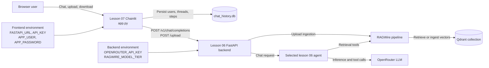

# Chainlit frontend workflow

This lesson is a user interface for the FastAPI service in
`../06 FastAPI RAG Backend`. It does not initialize RAGWire, choose an LLM, or
hold the OpenRouter credential. The backend owns inference and model selection.

## High-level architecture

The browser talks only to Chainlit. Chainlit handles the user experience and
forwards work to the lesson 06 FastAPI backend; it never calls OpenRouter or
Qdrant directly.



| Part | Connected to | Responsibility |
|---|---|---|
| Browser | Chainlit `app.py` | Displays messages, uploads files, and receives PDF downloads. |
| Chainlit `app.py` | FastAPI `/v1/chat/completions` | Sends conversation history and streams the generated response. |
| Chainlit `app.py` | FastAPI `/upload` | Forwards uploaded documents; this can trigger ingestion and change Qdrant. |
| Chainlit data layer | `data/chat_history.db` | Stores local users, threads, messages, and related UI state. |
| FastAPI backend | Selected lesson 06 agent and RAGWire | Owns orchestration, retrieval, model selection, and inference. |
| RAGWire and agents | Qdrant | Retrieve existing vectors; ingestion writes must be treated as database mutations. |
| RAGWire and agents | OpenRouter | Use the backend-selected free or paid model for inference. |
| Root `.env` | Frontend and backend processes | Supplies process configuration, but secrets and model selection remain backend concerns. |

## 1. Configure and start the backend

Set the backend environment before starting lesson 06:

```dotenv
OPENROUTER_API_KEY=your-openrouter-key
RAGWIRE_MODEL_TIER=free
```

`RAGWIRE_MODEL_TIER` accepts `free` or `paid`:

- `free` selects `nvidia/nemotron-3-super-120b-a12b:free`. OpenRouter's free
  NVIDIA endpoint may log prompts, so use only public or non-sensitive data.
- `paid` selects `nex-agi/nex-n2-mini`. It requires OpenRouter credit and every
  live request can be billable. Select it explicitly; the application must
  never fall back to it automatically.

Follow `../06 FastAPI RAG Backend/06 FastAPI RAG Backend.md` to verify the
intended Qdrant instance and start the API on port `8080`. Do not recreate,
delete, or re-index a Qdrant collection merely because the LLM tier changed.

## 2. Configure the frontend

`app.py` loads `../.env`. These variables configure only the frontend and its
connection to FastAPI:

```dotenv
FASTAPI_URL=http://localhost:8080
API_KEY=
APP_USER=choose-a-local-username
APP_PASSWORD=choose-a-strong-local-password
```

Do not put `OPENROUTER_API_KEY` in browser settings or add a model selector to
this Chainlit app. `RAGWIRE_MODEL_TIER` belongs to the backend process, even if
both processes happen to read the same root `.env` during local development.

The current backend does not validate `API_KEY`, so leaving it empty is correct
for local use. The frontend defaults to `admin` / `admin` when credentials are
unset; that is unsafe anywhere beyond an isolated local machine.

Never commit `.env` or real credential values.

## 3. Initialize chat history

From this lesson directory, initialize the local SQLite schema once:

```bash
../.venv/bin/python init_db.py
```

This writes `data/chat_history.db`. The database is local generated state and
must not be committed.

## 4. Start Chainlit

With the FastAPI backend already running:

```bash
../.venv/bin/chainlit run app.py
```

The UI sends uploads to `/upload` and streams chat responses from
`/v1/chat/completions`. Changing the backend's tier requires restarting the
backend, not changing frontend code.

## 5. Safe verification

Use synthetic or public text only. Verify that:

1. Chainlit opens and accepts the configured login.
2. A chat request reaches `http://localhost:8080/v1/chat/completions`.
3. A public test document reaches `http://localhost:8080/upload` only if an
   ingestion mutation is intended and approved.
4. The backend logs the selected tier and model ID.

A chat or upload test can invoke the external LLM, and an upload can mutate the
Qdrant collection. Do not run those live checks when avoiding API traffic or
database changes. Static frontend validation does not require either operation.

## 6. Known tool-error failure mode and required hardening

These safeguards are **required but not yet implemented** in the lesson 06
backend. Do not claim that the application provides grounded answers reliably
until they are implemented and tested.

A verified Apple 2025 query demonstrated the current failure mode:

- local Qdrant was healthy and `search_documents` retrieved five chunks from
  `Apple_10k_2025.pdf`;
- the retrieval tool returned roughly 42,000 characters, which is excessive for
  a single agent observation;
- the free NVIDIA endpoint returned `Service temporarily overloaded` during a
  live agent trace; and
- the model then described the problem as a tool error and supplied an
  unsupported answer from memory. The filing reports total 2025 net sales of
  `$416.161 billion`, not the model's `$402.3 billion` claim.

The backend must be hardened as follows:

1. **Limit retrieval output.** Cap the number and length of returned chunks and
   enforce a total character or token budget before tool output is sent back to
   the model. Preserve source filenames and page metadata after truncation.
2. **Classify failures accurately.** Distinguish Qdrant/retrieval exceptions,
   invalid tool arguments, provider authentication failures, rate limits,
   upstream-capacity failures, and model/tool-schema incompatibility. Do not
   collapse all of them into a generic "tool error."
3. **Require successful retrieval before answering.** Track whether a valid
   `search_documents` result was received. If retrieval or the post-tool model
   call fails, return a deterministic error and do not let the model produce a
   factual answer.
4. **Forbid ungrounded fallback answers in code.** Prompt instructions alone are
   insufficient. Reject answers that have no successful retrieval evidence or
   source reference instead of allowing "publicly known" or model-memory facts.
5. **Keep paid usage explicit.** On free-endpoint overload, tell the operator to
   retry later or explicitly restart the backend with
   `RAGWIRE_MODEL_TIER=paid`. Never switch tiers automatically; paid requests
   require OpenRouter credit and are billable.

Validation must cover a direct retrieval test and a separate live tool-call
test. Record the selected model, tool arguments, tool-result size, source
metadata, and exact failure category. A successful direct Qdrant retrieval does
not prove that the selected model can complete the agent tool-call cycle.
