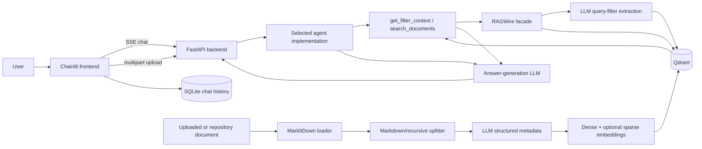

# Project Overview

## 1. Executive Summary

RAGWire is an AI/RAG learning and prototype repository built around a reusable Python package, `ragwire`, plus progressively richer tutorial applications. The package ingests documents, converts them to Markdown, splits them into chunks, extracts structured metadata with an LLM, creates dense and optional sparse embeddings, stores chunks in Qdrant, and retrieves them through semantic, hybrid, or MMR search. The surrounding examples progress from notebooks to a direct Chainlit chatbot and then to a split Chainlit/FastAPI system with interchangeable agent frameworks.

The central architectural path is:

`Document -> MarkItDown -> chunking -> LLM metadata extraction -> embeddings -> Qdrant`

and, for chat:

`Chainlit -> FastAPI/SSE -> selected agent -> RAG tools -> Qdrant -> answer`

Despite the package description calling it “production-grade,” the repository as a whole is an educational/workbench codebase, not a production-ready platform. Evidence includes numbered lesson directories, notebooks, eight experimental agent implementations, an empty root README, import-time service initialization, incomplete dependency declarations, no deployment/CI definition, and serious API security gaps.

This report describes the current working tree, including uncommitted and untracked application code. Generated/dependency directories (`.git`, `.venv`, caches, logs, notebook checkpoints) and binary data contents were excluded from code-level analysis.

## 2. Repository Structure

```text
.
├── ragwire/                         # Reusable RAG library
│   ├── core/                        # Configuration and RAGWire facade
│   ├── loaders/                     # MarkItDown document conversion
│   ├── processing/                  # Splitting and SHA-256 hashing
│   ├── metadata/                    # Pydantic schemas and LLM extraction
│   ├── embeddings/                  # Provider factory
│   ├── vectorstores/                # Qdrant adapter
│   ├── retriever/                   # Similarity/hybrid/MMR helpers
│   └── utils/                       # Logging
├── 02 RAGWire Setup and First Retrieval/
│   └── *.ipynb, config*.yaml        # Introductory ingestion/retrieval lesson
├── 03 RAGWire in Practice - Providers, Components, and Cookbooks/
│   └── *.ipynb, config*.yaml        # Provider and Qdrant/MMR examples
├── 04 Personal Gym Supplements RAG/
│   ├── *.ipynb, health_metadata.yaml
│   ├── diagnostic/repair scripts
│   └── ragwire/                     # Near-copy of the root package
├── 05 Conversational RAG Chatbot with Chainlit/
│   ├── app.py                       # In-process Chainlit + LangChain agent
│   └── reingest_and_test.py
├── 06 FastAPI RAG Backend/
│   ├── main.py, routes.py, tools.py
│   ├── agents/                      # Eight selectable agent variants
│   ├── config/                      # Finance RAG configuration/schema
│   └── tests/                       # Stream-filter unit tests
├── 07 Chainlit Chat Frontend/
│   ├── app.py                       # HTTP/SSE client UI
│   ├── init_db.py                   # Chat-history schema bootstrap
│   └── WORKFLOW.md
├── tests/                            # Metadata-extractor unit tests
├── data/                             # Finance/health PDFs, DOCX, design data
├── scripts/                          # Qdrant probe and HF-cache maintenance
├── docs/superpowers/                 # CrewAI streaming design/plan
├── pyproject.toml, requirements.txt  # Dependency declarations
├── start_qdrant.sh                   # Local Qdrant convenience script
└── main.py, README.md                 # Placeholder entry point; empty README
```

Architecturally irrelevant or generated material includes `.venv`, `.pytest_cache`, `.log`, `__pycache__`, `.chainlit`, `ragwire.egg-info`, and notebook outputs. A notable exception is the tracked `03 .../${QDRANT_URL}/.../storage.sqlite`: it is a generated local Qdrant database created because an unresolved environment placeholder was interpreted as a filesystem path.

## 3. Technology Stack

| Area | Evidence-backed technologies | Role |
|---|---|---|
| Language/runtime | Python 3.12+; Bash | Library, services, notebooks, maintenance scripts |
| Packaging | PEP 621 `pyproject.toml`; legacy `requirements.txt` | Project metadata and dependency lists; no lock file or build-system declaration |
| RAG orchestration | LangChain / LCEL | Documents, prompts, tools, retrievers, agents |
| Document conversion | Microsoft MarkItDown | PDF/DOCX/XLSX/PPTX/text to Markdown |
| Chunking | `langchain-text-splitters` | Markdown-aware, recursive, and code-oriented splitting |
| Metadata | Pydantic v2 + LLM structured output + YAML schemas | Typed finance/health metadata extraction |
| Dense embeddings | OpenAI, Hugging Face, Ollama, Google/Gemini, FastEmbed | Provider-selected vector generation |
| Sparse retrieval | `FastEmbedSparse` | Sparse side of Qdrant hybrid retrieval |
| Vector database | Qdrant / `langchain-qdrant` | Chunk vectors, payload metadata, filtering, facets |
| LLMs | OpenAI-compatible APIs, OpenRouter, Ollama, Google, Groq, Anthropic, NVIDIA endpoint | Metadata extraction, filter extraction, answer generation |
| Agent frameworks | LangChain, LangGraph, CrewAI, AutoGen, Microsoft `agent_framework` | Alternative reasoning/orchestration experiments |
| Backend/API | FastAPI, Uvicorn, SSE | OpenAI-shaped streaming chat and upload API |
| Frontend | Chainlit, HTTPX | Chat, upload, streaming display, authentication callback |
| Chat persistence | SQLite, Aiosqlite, Chainlit SQLAlchemy data layer | Users, threads, steps, feedback, elements |
| Export | Markdown2, XHTML2PDF | Chat-answer PDF generation |
| Tests | Pytest | Focused metadata and stream-filter unit tests |
| Operations | Docker CLI for Qdrant; dotenv; Python logging | Local service startup and configuration |

No Kubernetes, Terraform, Docker Compose, application Dockerfile, message broker, distributed cache, CI/CD workflow, metrics backend, or tracing integration is implemented in the repository.

## 4. System Architecture



The `RAGWire` class is a facade and composition root. It loads YAML/dotenv configuration, constructs all provider-specific components, owns one Qdrant collection, and exposes ingestion, retrieval, filter-discovery, and collection-stat APIs. Lower-level modules depend on LangChain/Qdrant abstractions; the FastAPI and Chainlit layers depend on the facade, not vice versa.

The backend uses one process-global `RAGWire` instance created when `06 FastAPI RAG Backend/tools.py` is imported. An `AGENT` environment variable selects a module whose common contract is `MODEL_ID` plus `async stream(messages)`. This makes agent implementations swappable, but model loading, Qdrant connectivity, collection creation, and agent construction all happen during module import/startup.

## 5. Core Components

### 5.1 `ragwire/core`

`config.py` loads YAML, calls `load_dotenv()`, and recursively substitutes `${VAR}` strings. Missing variables generate a warning but remain unresolved. `pipeline.py` defines `RAGWire`, the primary public API and the orchestration point for every write/read path.

Important behavior:

- Initialization order is logging -> loader -> splitter -> embeddings -> LLM/metadata -> Qdrant -> retriever.
- LLM, embedding, Qdrant, chunking, metadata, and retrieval behavior are configuration-driven.
- `force_recreate` can delete and rebuild a collection during startup.
- File ingestion returns per-run totals, processed/skipped/failed counts, chunk count, and errors.
- Retrieval builds a fresh retriever per request so per-call `k` and filters do not mutate the shared retriever.

### 5.2 Loading, splitting, and hashing

`ragwire/loaders/markitdown_loader.py` validates the path, delegates conversion to MarkItDown, and returns a normalized result dictionary rather than propagating most conversion failures. Batch and directory helpers process files independently.

`ragwire/processing/splitter.py` provides Markdown-header-aware, recursive-character, and code-oriented splitters. Default pipeline values are large (10,000 characters with 2,000 overlap). `hashing.py` computes streaming file SHA-256 hashes and deterministic chunk hashes based on file hash, position, and content.

### 5.3 Metadata extraction

`ragwire/metadata/extractor.py` uses `llm.with_structured_output()` with either the built-in `FinancialMetadata` model or a Pydantic model generated from YAML fields. Strings are normalized to lowercase. The extractor sends a document prefix plus a Markdown-heading outline and can retry once with a larger raw window when all values, or configured required values, are missing.

The current root constants are 5,000 prefix characters, 1,500 outline characters, and an 18,000-character retry. The nested copy under lesson 04 still uses 3,000/1,000/12,000, which creates import-location-dependent behavior.

### 5.4 Embeddings, Qdrant, and retrieval

`ragwire/embeddings/factory.py` lazily constructs the selected provider's LangChain embeddings implementation. `ragwire/vectorstores/qdrant_store.py` owns the Qdrant client, collection lifecycle, vector-store adapter, file-hash lookup, payload indexes, schema discovery, and facets.

New collections use cosine dense vectors and, when enabled, a named FastEmbed sparse vector. Domain and system metadata live under the LangChain `metadata` payload. Retrieval supports similarity and MMR directly; “hybrid” is enabled by constructing the vector store in hybrid mode, after which normal similarity calls combine dense and sparse retrieval internally.

Plain dictionaries are converted to Qdrant filters with AND semantics across fields and OR semantics within a list-valued field.

### 5.5 Agent layer

`06 FastAPI RAG Backend/agents/` contains alternative implementations behind the same streaming contract:

| Module | Pattern |
|---|---|
| `01_langchain_agent.py` | Default LangChain tool-calling agent |
| `02_langgraph_self_correcting_agent.py` | Retrieve/generate/rewrite loop |
| `03_langgraph_supervisor_agent.py` | Supervisor routing to financial, legal-risk, technical, and summary specialists |
| `04_crewai_agent.py` | Single CrewAI document analyst |
| `05_crewai_multiagent.py` | Sequential/multi-role CrewAI workflow |
| `06_autogen_agent.py` | AutoGen round-robin team |
| `07_microsoft_agent.py` | Single Microsoft agent-framework agent |
| `08_microsoft_multiagent.py` | Microsoft workflow with specialists, collectors, and synthesizer |

These are experiments rather than one consolidated production agent. The default is `01_langchain_agent`; the deployed choice cannot be determined conclusively because `AGENT` is runtime configuration.

### 5.6 Application layers

`05 .../app.py` is a self-contained Chainlit application: it initializes RAGWire and a LangChain agent in the UI process, stores conversation state in an in-memory LangGraph checkpointer, handles uploads locally, and invokes the agent directly.

Lessons 06 and 07 split responsibilities. FastAPI owns RAG and agent execution; Chainlit owns UI, chat history, upload forwarding, response cleanup, and PDF export. `07 .../init_db.py` creates Chainlit-compatible SQLite tables.

## 6. Application / Execution Flow

### Backend startup

1. Run from `06 FastAPI RAG Backend/` so relative config imports resolve.
2. `main.py` loads dotenv, imports `routes`, and constructs FastAPI.
3. `routes.py` imports `tools.py`; this immediately constructs the global `RAGWire` instance.
4. RAGWire may load a local embedding model, initialize the metadata LLM, contact/create a Qdrant collection, and build payload indexes.
5. `routes.py` dynamically imports the configured agent module; that module constructs its answer LLM/agent.
6. FastAPI installs permissive CORS, registers routes, and Uvicorn listens on port 8080 when `main.py` is executed directly.

### Representative chat request

1. Chainlit stores the user message in session history and POSTs it to `/v1/chat/completions`.
2. FastAPI converts Pydantic messages to dictionaries and calls the selected agent's `stream()` generator.
3. The agent calls `get_filter_context` when appropriate. RAGWire uses Qdrant facets to expose stored values and asks the metadata LLM to extract filters from the query.
4. The agent calls `search_documents`; RAGWire creates Qdrant filter conditions, embeds the query, and retrieves the top chunks.
5. The agent LLM synthesizes an answer with source filenames.
6. FastAPI wraps emitted text in OpenAI-style SSE `chat.completion.chunk` records; Chainlit parses and displays tokens, persists the answer, and offers PDF export.

### Representative ingestion request

1. `/upload` writes multipart files into a temporary directory and calls `rag.ingest_directory()`.
2. Each file is SHA-256 hashed. If any Qdrant point already contains that hash, the whole file is skipped.
3. MarkItDown converts the source to Markdown; the configured splitter creates chunks.
4. The metadata LLM processes a representative sample once per document, with a conditional second pass.
5. System metadata and extracted domain metadata are attached to every chunk.
6. Dense/sparse vectors and payloads are uploaded to Qdrant in configured batches.
7. Payload indexes are refreshed and the in-memory facet-value cache is invalidated.

## 7. Data Flow and Persistence

Qdrant is the primary knowledge store. Each point represents a chunk and carries source path, filename/type, file and chunk hashes, chunk position/count, UTC creation time, and domain metadata such as company/year or health-research fields. Collections can be remote HTTP(S) services or local embedded Qdrant directories.

The Chainlit frontend separately persists users, threads, steps, feedback, and UI elements in `07 Chainlit Chat Frontend/data/chat_history.db` through Aiosqlite/SQLAlchemy. This is chat state only; it is not the RAG source of truth.

Repository PDFs/DOCX files are seed/demo inputs. There is no queue, event stream, durable job state, transactional ingestion ledger, or shared cache. `_stored_values_cache` is an in-process cache of Qdrant facet values and is invalidated only after ingestion through that RAGWire instance.

## 8. API and External Integrations

FastAPI exposes:

- `GET /health`: process-level status only; it does not verify Qdrant or LLM dependencies.
- `GET /v1/models` and `GET /v1/models/{model_id}`: OpenAI-shaped model metadata.
- `POST /v1/chat/completions`: always returns SSE; only `model` and `messages` are modeled.
- `POST /upload`: accepts multiple multipart files and synchronously ingests them.

The API is OpenAI-shaped, not fully OpenAI-compatible: common generation parameters and non-streaming responses are not implemented, and the requested model is not used to select an agent/model.

External integrations are Qdrant, OpenRouter/OpenAI-compatible APIs, NVIDIA's OpenAI-compatible endpoint, Ollama, Google Gemini, Groq, Anthropic, Hugging Face model downloads, and optional Qdrant Cloud. Actual live endpoints and service health were not contacted during this analysis.

## 9. AI / ML Architecture

This is an inference-only system; no training, fine-tuning, model registry, evaluation harness, or model-serving infrastructure is present.

- **Metadata inference:** one structured-output LLM call per document, with at most one larger-window retry. Custom YAML files define prompt text, field descriptions, list/integer types, examples, and required fields.
- **Embedding inference:** provider-selected dense embeddings; current application configs use local BGE-M3 on CPU. Sparse FastEmbed vectors support hybrid retrieval.
- **Query understanding:** optional auto-filtering and agent filter context use the metadata LLM to translate natural language into exact Qdrant payload filters grounded in stored facet values.
- **Answer generation:** a selected agent framework calls retrieval tools and an external LLM, often through OpenRouter.
- **Guardrails:** Pydantic constrains metadata shape and agents are prompted to search/cite, but there is no content moderation, prompt-injection defense, provenance validation, tenant isolation, or deterministic citation verifier.
- **Cost/latency:** ingestion pays for document conversion, one or two metadata calls, and embeddings for every chunk. Query-time auto-filtering adds an LLM call before retrieval, while agents may issue multiple searches and synthesis calls. There is no token/cost budget enforcement.
- **Observability:** Python logs capture initialization, ingestion, retrieval, and errors. Environment names suggest optional LangSmith/CrewAI tracing, but no repository code makes those systems a required or consistent telemetry layer.

## 10. Configuration and Environment

Configuration is split between dotenv and per-lesson YAML files. YAML controls loader extensions, splitter settings, embedding/LLM providers and models, Qdrant URL/key/collection, sparse mode, recreation, batch size, retrieval mode/top-k/auto-filtering, metadata schema path, and logging.

Code or configuration references environment variables including `QDRANT_URL`, `QDRANT_API_KEY`, provider API keys, `LLM_PROVIDER`, model IDs, `AGENT`, `FASTAPI_URL`, `API_KEY`, `APP_USER`, `APP_PASSWORD`, and Chainlit/LangSmith/CrewAI settings. The root `.env` is ignored by Git and was inspected only for variable names; no values are reproduced here. There is no committed `.env.example` because the `.gitignore` excludes example/template env files as well.

Two configuration hazards are important:

1. Paths such as `config/finance_metadata.yaml`, log paths, SQLite paths, and application configs are resolved against the process working directory, not the YAML or source-file directory.
2. An unset `${QDRANT_URL}` remains a literal string. Since it does not start with HTTP, `QdrantStore` treats it as a local filesystem path. The tracked `${QDRANT_URL}` directory proves this failure mode has occurred.

## 11. Testing and Code Quality

There are two focused Pytest suites: root tests cover metadata sampling, retry, merging, and YAML-required fields; backend tests cover the standalone final-answer stream filter. No unit tests cover the RAGWire facade, configuration substitution, embedding/vector-store adapters, deduplication, filters, uploads, authentication, agent modules, SQLite integration, or the full API/UI path. No coverage, lint, formatter, type-checker, pre-commit, or CI configuration is present.

The current tests could not be executed. The repository virtual environment's Python symlink points to a missing interpreter, and the system Python does not have Pytest. Static inspection also finds at least two guaranteed test/implementation conflicts: root tests assert 3,000/1,000-character metadata windows while the root implementation defines 5,000/1,500. Those tests match the nested lesson-04 copy instead. Test pass status is therefore unable to be determined conclusively from execution, but the current root suite is internally inconsistent on inspection.

The stream-filter tests target `FinalAnswerStreamFilter`, yet the current single CrewAI agent duplicates separate cleanup logic and does not import that class. This weakens the tests' protection of the actual runtime path.

## 12. Deployment and Infrastructure

There is no defined deployment topology. `start_qdrant.sh` is the only infrastructure automation: it removes existing containers derived from the Qdrant image, removes the image, pulls the unpinned latest image, and starts Qdrant with ports 6333/6334. It does not mount durable storage, pin a version, configure authentication, or restrict port binding.

Backend and frontend must be started separately and from specific working directories. No process manager, container image, health/readiness dependency check, autoscaling policy, reverse proxy, TLS termination, secret manager, backup/restore procedure, or environment promotion workflow is supplied.

## 13. Security Considerations

Observed controls are limited to ignored dotenv secrets, optional Qdrant API keys, Chainlit's password callback, temporary upload directories, and SHA-256 hashing. They are insufficient for an exposed service.

Critical observable issues:

- FastAPI has no authentication or authorization. The frontend may send an `Authorization` header, but the backend never validates it.
- CORS allows every origin, method, and header while credentials are enabled.
- `/upload` joins the client-supplied filename directly to the temporary directory. Absolute filenames or `..` segments can escape that directory and overwrite writable files.
- Uploads have no size, count, extension, MIME, decompression, or parsing limits and are read fully into memory before synchronous document processing.
- The frontend defaults to `admin`/`admin` when credentials are not configured.
- All users share one global Qdrant collection; there is no tenant/user document isolation.
- Retrieved document text is fed to agents without prompt-injection or data-exfiltration defenses.
- Backend exception text is streamed to clients, potentially exposing internal paths and provider details.
- Chat history and document payloads are stored without repository-defined encryption or retention controls.

## 14. Architectural Strengths

- **Observed:** `RAGWire` provides a clear facade over loader, splitter, metadata, embedding, vector, and retrieval modules.
- **Observed:** provider-specific dependencies are imported lazily and configuration selects models without changing core pipeline code.
- **Observed:** Pydantic structured output and YAML-generated schemas are stronger than manual JSON parsing for metadata extraction.
- **Observed:** deterministic hashes, batch uploads, per-file error isolation, and collection facets address real ingestion/retrieval needs.
- **Observed:** query filters are grounded against values actually stored in Qdrant, reducing alias and casing mismatches.
- **Observed:** the common agent streaming contract makes orchestration frameworks replaceable at the API boundary.
- **Observed:** the metadata repair tooling recognizes that extraction is probabilistic and provides diagnosis, deletion, re-ingestion, and verification workflows.

## 15. Risks and Improvement Opportunities

| Priority | Classification | Finding and precise action |
|---|---|---|
| High | Observed risk | **Unauthenticated, unsafe upload API.** Add backend auth, strict CORS, basename/UUID server-side filenames, resolved-path containment checks, file/count/size/type limits, streaming writes, rate limits, and malware/parser isolation before exposing the service. |
| High | Observed risk | **Async API performs blocking work.** Qdrant calls, local model inference, MarkItDown conversion, LLM calls, and ingestion run synchronously inside async routes. Move ingestion to a bounded worker/job queue and offload blocking retrieval; add job status and cancellation. |
| High | Observed risk | **Partial ingestion can become permanently incomplete.** If an early batch succeeds and a later batch fails, the next run sees the file hash and skips the file. Use a document-level ingestion record/state, deterministic point IDs, transactional staging, or delete/replace all points for a failed file. |
| High | Observed risk | **Dangerous data lifecycle.** `force_recreate` deletes collections at startup, and `start_qdrant.sh` removes containers/images without a volume. Default destructive flags to false, separate migration/admin commands from startup, pin Qdrant, mount storage, and document backups. |
| High | Observed risk | **Environment fallback silently changes persistence.** Validate all required placeholders and URL schemes before Qdrant construction; never interpret unresolved `${...}` values as local paths. Remove generated vector databases from Git. |
| High | Observed risk | **Build/test reproducibility is not credible.** Repair/recreate the venv, add a lock file and build backend, declare every direct dependency, split core/app/agent optional groups, pin compatible major versions, and run tests/lint/type checks in CI. |
| Medium | Observed risk | **Two `ragwire` copies can shadow each other.** Delete the lesson-04 copy or package/version the library and install it into examples. Tests and examples must import one canonical implementation. |
| Medium | Observed risk | **Working-directory coupling.** Resolve schema/config/log/DB paths relative to the owning config/source file and provide explicit CLI entry points. |
| Medium | Observed risk | **Metadata failure is silently accepted.** Extraction exceptions still produce indexed chunks with missing domain fields. Record extraction status/errors, validate required fields, and provide first-class repair/update APIs instead of external delete/re-ingest scripts. |
| Medium | Observed risk | **Custom-prompt grounding is ineffective.** Existing stored values are injected by replacing an `## Document Text` marker, but custom prompts use a different appended marker, so the replacement can be a no-op. Build prompts compositionally and test custom schemas. |
| Medium | Observed risk | **Qdrant schema/index discovery is fragile.** It inspects one point, hard-codes only a few integer field names, and suppresses every payload-index exception. Maintain explicit field types from the metadata schema and log/raise unexpected index failures. |
| Medium | Reasonable inference | **No multi-user privacy boundary.** A single global collection and agent toolset mean an authenticated multi-user deployment would still allow cross-user retrieval unless collections or payload ACL filters are introduced. |
| Medium | Observed risk | **Agent sprawl and duplicated output-cleaning logic.** Select one supported runtime, isolate experiments, and test the exact selected stream path. |
| Low | Observed issue | **Documentation/package polish is incomplete.** Replace the empty README and placeholder root `main.py`; document install, commands, architecture, supported configs, security assumptions, and troubleshooting. |
| Low | Observed issue | **Repository hygiene is poor.** Remove tracked generated Qdrant state, binary churn, `.DS_Store`, stale absolute local paths in scripts/docs, and keep datasets outside the core package or under an explicit data policy. |

## 16. Key Files for New Engineers

1. `ragwire/core/pipeline.py` — the composition root and complete ingestion/retrieval lifecycle.
2. `ragwire/core/config.py` — dotenv/YAML behavior and the unresolved-placeholder failure mode.
3. `ragwire/metadata/extractor.py` — structured metadata prompts, dynamic schemas, sampling, and retry policy.
4. `ragwire/vectorstores/qdrant_store.py` — collection lifecycle, hybrid setup, dedup checks, facets, and indexes.
5. `ragwire/embeddings/factory.py` and `ragwire/retriever/hybrid.py` — provider and retrieval strategy boundaries.
6. `06 FastAPI RAG Backend/tools.py` — global pipeline construction and agent-visible RAG tools.
7. `06 FastAPI RAG Backend/routes.py` and `main.py` — API contract, streaming, uploads, and startup behavior.
8. `06 FastAPI RAG Backend/agents/01_langchain_agent.py` — default runtime agent; compare other numbered modules only after understanding this one.
9. `06 FastAPI RAG Backend/config/6config_openrouter_qdrant.yaml` and `finance_metadata.yaml` — active backend model/vector/schema configuration.
10. `07 Chainlit Chat Frontend/app.py` and `init_db.py` — UI/API bridge, auth, history, uploads, and PDF export.
11. `tests/test_metadata_extractor.py` and `06 FastAPI RAG Backend/tests/test_stream_filter.py` — current quality boundary and visible drift.
12. `pyproject.toml` — declared runtime surface; compare it with direct imports before attempting deployment.

## 17. Mental Model of the System

A new senior engineer should model this as **one synchronous, configuration-driven RAG library surrounded by a collection of educational adapters and agent experiments**. The library owns the knowledge lifecycle: documents become Markdown, chunks, structured metadata, embeddings, and Qdrant points; queries optionally become metadata filters and then retrieve chunks. The split application adds a thin OpenAI-shaped streaming API and a Chainlit client, while the selected agent decides how many retrieval/tool calls to make before synthesizing an answer. SQLite stores conversations, Qdrant stores knowledge, and external/local LLM providers do metadata and answer inference.

Do not mentally model it as a production platform yet. There is no durable ingestion control plane, async job system, security boundary, deployment contract, reproducible build, or comprehensive verification layer. The fastest path to a reliable system is to stabilize the canonical package and dependency set, secure and de-block the API, make ingestion idempotent at document level, eliminate path/import ambiguity, choose one supported agent, and add integration tests around Qdrant plus the upload/chat lifecycle.
