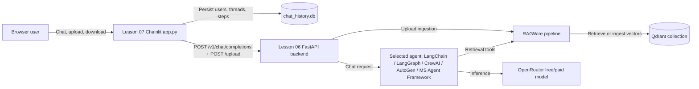

<div align="center">

# RAGWire

**Production-grade RAG toolkit for document ingestion and retrieval with hybrid search support**

[](https://www.python.org/)
[](https://github.com/Adnan-edu/advance_agentic_rag)
[](https://qdrant.tech/)
[](https://chainlit.io/)

Learn RAG end-to-end by building it: a reusable Python library, eight agent
implementations (LangChain, LangGraph, CrewAI, AutoGen, Microsoft Agent
Framework), an OpenAI-compatible FastAPI backend, and a Chainlit chat frontend —
all backed by Qdrant with hybrid search.

</div>

---

## Table of Contents

- [Overview](#overview)
- [Features](#features)
- [Architecture](#architecture)
- [Repository Structure](#repository-structure)
- [Prerequisites](#prerequisites)
- [Installation](#installation)
- [Configuration](#configuration)
- [Quick Start](#quick-start)
- [Using the Library](#using-the-library)
- [Model Tiers](#model-tiers)
- [Providers](#providers)
- [Metadata Extraction](#metadata-extraction)
- [Lesson Walkthrough](#lesson-walkthrough)
- [Full-Stack Chat Demo (Lessons 06 and 07)](#full-stack-chat-demo-lessons-06-and-07)
- [FastAPI API Reference](#fastapi-api-reference)
- [Selecting an Agent](#selecting-an-agent)
- [Testing](#testing)
- [Troubleshooting](#troubleshooting)
- [Security Notes](#security-notes)
- [Related Documentation](#related-documentation)
- [License](#license)

---

## Overview

RAGWire is an AI/RAG learning and prototyping repository built around a reusable
Python package, **`ragwire`**, plus progressively richer tutorial applications.
The package ingests documents, converts them to Markdown, splits them into
chunks, extracts structured metadata with an LLM, generates dense (and optional
sparse) embeddings, stores them in **Qdrant**, and retrieves them through
semantic, hybrid, or MMR search.

The numbered lesson directories (02 → 07) walk you from your first retrieval to
a full chatbot:

| Lesson | What you build |
|---|---|
| 02 | RAGWire setup and first document retrieval (notebook) |
| 03 | Providers, components, and cookbooks — OpenAI / Gemini / Groq / Ollama |
| 04 | A personal gym-supplements RAG with custom health metadata |
| 05 | A conversational RAG chatbot with Chainlit (in-process) |
| 06 | An OpenAI-compatible FastAPI backend with 8 interchangeable agents |
| 07 | A Chainlit chat frontend with auth, uploads, and PDF export |

---

## Features

**Document ingestion**
- Any format → Markdown via **MarkItDown** (PDF, DOCX, XLSX, PPTX, TXT, MD, HTML, and more)
- Configurable text splitting: generic recursive, markdown-aware, and code-aware splitters
- **SHA-256 file hashing** for idempotent ingestion — re-running the same files is a cheap no-op (reported as `skipped`)
- Batch upserts with per-file error isolation (`IngestStats` reports `processed` / `skipped` / `failed` / `chunks_created`)

**Metadata**
- LLM-based **structured metadata extraction** with Pydantic schemas (no manual JSON parsing)
- YAML-declared schemas with custom prompts, field types (`string`, `list`, `integer`), allowed values, and `required` flags
- Automatic content sampling plus one escalation retry for large documents
- `fail_on_extraction_error` option — prevents storing chunks that cannot be filtered
- Agent helpers: `get_filter_context()`, `extract_filters()`, `discover_metadata_fields()`, `get_field_values()`
- Optional `auto_filter` — LLM-based filter extraction from natural-language queries

**Retrieval**
- Dense (semantic) search, **hybrid search (dense + sparse/BM25)** via Qdrant, and **MMR** for diverse results
- Metadata-filtered retrieval, e.g. `{"company_name": "apple inc.", "fiscal_year": 2024}`
- Qdrant payload indexes and facet-based field-value discovery

**Providers**
- Embeddings: OpenAI, HuggingFace, Ollama, Google/Gemini, and **FastEmbed** (local, free)
- LLMs: **OpenRouter** (default) plus OpenAI, Groq, Google/Gemini, and Ollama example configs
- Free/paid **model tiers** with a strictly explicit, never-automatic fallback policy

**Applications**
- 8 swappable agent frameworks behind one OpenAI-compatible FastAPI server
- Streaming (SSE) chat completions, model listing, health checks, and document upload endpoints
- Chainlit chat UI with password auth, SQLite chat history, PDF export, and drag-and-drop uploads
---

## Architecture

### Ingestion path

```text
PDF / DOCX / XLSX / PPTX / TXT / MD / HTML
        │  MarkItDownLoader  (any format → Markdown text)
        ▼
   Markdown text
        │  TextSplitter  (recursive / markdown / code)
        ▼
      chunks
        │  MetadataExtractor  (LLM structured output using a YAML-defined Pydantic schema)
        ▼
  chunk + metadata (e.g. company_name="apple inc.", fiscal_year=2024)
        │  Embeddings  (dense; optional sparse for hybrid search)
        ▼
        Qdrant collection
```

### Retrieval path

```text
      query
        │  (optional) LLM filter extraction  →  {"company_name": "apple inc.", "fiscal_year": 2024}
        ▼
   Qdrant hybrid search (dense vectors + sparse/BM25, with metadata filters)
        ▼
   top-k chunks returned as LangChain Documents
```

### Chat path (lessons 06 + 07)



The FastAPI backend owns all inference, model selection, retrieval, and
ingestion. The Chainlit frontend only manages the user experience and forwards
work to the backend — it never calls OpenRouter or Qdrant directly.
---

## Repository Structure

```text
.
├── ragwire/                          # Reusable RAG library (the package)
│   ├── core/                         # YAML/Env config loader + RAGWire facade pipeline
│   ├── loaders/                      # MarkItDown document conversion
│   ├── processing/                   # Text splitters + SHA-256 hashing
│   ├── metadata/                     # Pydantic schemas + LLM metadata extraction
│   ├── embeddings/                   # Provider factory (OpenAI, HF, Ollama, Google, FastEmbed)
│   ├── vectorstores/                 # Qdrant adapter (hybrid, indexes, facets)
│   ├── retriever/                    # Similarity / hybrid / MMR helpers
│   └── utils/                        # Logging helpers
├── 02 RAGWire Setup and First Retrieval/
│   └── notebook + config.yaml        # First ingestion and retrieval
├── 03 RAGWire in Practice - Providers, Components, and Cookbooks/
│   └── notebook + provider configs   # OpenAI / Gemini / Groq / Ollama / Qdrant / MMR
├── 04 Personal Gym Supplements RAG/
│   ├── notebook + health_metadata.yaml
│   └── maintenance scripts           # reingest_missing, check_missing_metadata
├── 05 Conversational RAG Chatbot with Chainlit/
│   └── app.py                        # In-process Chainlit + LangChain agent
├── 06 FastAPI RAG Backend/
│   ├── main.py / routes.py / tools.py
│   ├── agents/                       # 8 selectable agent implementations
│   ├── config/ + model_tier_config/  # Finance RAG configs and metadata schema
│   └── tests/                        # Stream-filter + model-tier wiring tests
├── 07 Chainlit Chat Frontend/
│   ├── app.py                        # HTTP/SSE client UI (auth, uploads, PDF export)
│   ├── init_db.py                    # SQLite chat-history schema bootstrap
│   └── WORKFLOW.md                   # Frontend ↔ backend integration guide
├── data/                             # Sample documents (finance, health, books, blueprint)
│   ├── finance_data/                 # Apple / Amazon / Google / Meta 10-K PDFs
│   ├── health_data/                  # Sports-science research PDFs
│   └── books_data/                   # Book source documents (e.g. LLM book DOCX)
├── tests/                            # Package unit tests (metadata extractor)
├── scripts/
│   ├── check_qdrant.py               # Health probe for local or cloud Qdrant
│   └── cleanup_hf_cache.py           # HuggingFace cache maintenance
├── docs/superpowers/                 # CrewAI real-time streaming design + plan
├── start_qdrant.sh                   # Local Docker Qdrant launcher (persistent volume)
├── pyproject.toml                    # Package metadata + dependencies
├── requirements.txt                  # pip-installable dependency list
├── uv.lock                           # Lockfile for `uv`
└── main.py                           # Placeholder package entry point
```

---

## Prerequisites

| Tool | Why | Notes |
|---|---|---|
| **Python 3.12+** | Runtime | The repository pins Python **3.13** in `.python-version` |
| **Docker** | Local Qdrant vector database | Docker Desktop or compatible daemon |
| **curl** | Qdrant health checks | Used by `start_qdrant.sh` |
| **[uv](https://docs.astral.sh/uv/)** | Fast, lockfile-driven dependency management | Recommended; `pip` also works |
| **OpenRouter API key** | LLM inference (default provider) | Free signup at [openrouter.ai](https://openrouter.ai) |

Optional: API keys for OpenAI, Groq, Google, HuggingFace, or LangSmith tracing
(see [Configuration](#configuration)).
---

## Installation

Clone the repository and install the package with its dependencies:

```bash
git clone https://github.com/Adnan-edu/advance_agentic_rag.git
cd advance_agentic_rag

# Recommended: uv (reads .python-version and uv.lock)
uv sync

# Activate the virtual environment
source .venv/bin/activate
```

> Prefer `pip`? `python -m venv .venv && source .venv/bin/activate && pip install -r requirements.txt`

`uv sync` creates a `.venv` and installs the `ragwire` package in editable/dev
mode along with every dependency (LangChain, Qdrant, Chainlit, CrewAI, AutoGen,
FastAPI, MarkItDown, FastEmbed, and friends). You can verify the install:

```bash
uv run python -c "import ragwire; print(ragwire.__version__)"
```

---

## Configuration

### 1. Create your `.env` file

Copy the template and fill in at least your **OpenRouter key**:

```bash
cp .env.example .env
```

The project loads environment variables from `.env` at the repository root
(`python-dotenv`, called from `ragwire/core/config.py`). **`.env` is git-ignored
— never commit real keys.**

| Variable | Required | Purpose |
|---|---|---|
| `OPENROUTER_API_KEY` | ✅ (default path) | OpenRouter LLM access for all current lesson configs |
| `RAGWIRE_MODEL_TIER` | — | `free` (default) or `paid`; see [Model Tiers](#model-tiers) |
| `QDRANT_URL` | — | Cloud Qdrant URL; leave empty for local Docker |
| `QDRANT_API_KEY` | — | Cloud Qdrant API key; leave empty for local Docker |
| `AGENT` | — | FastAPI backend agent selector, e.g. `01_langchain_agent` |
| `FASTAPI_URL` | — | Lesson 07 frontend → backend URL (`http://localhost:8080`) |
| `APP_USER` / `APP_PASSWORD` | — | Chainlit login credentials (defaults: `admin` / `admin`) |
| `API_KEY` | — | Optional Bearer token sent by the frontend to the backend |
| `CHAINLIT_AUTH_SECRET` | — | Chainlit session-signing secret (use a long random string) |
| `OPENAI_API_KEY`, `GROQ_API_KEY`, `GOOGLE_API_KEY`, `HF_TOKEN` | — | Provider examples in lesson 03 |
| `LANGSMITH_API_KEY`, `LANGSMITH_TRACING` | — | Optional [LangSmith](https://smith.langchain.com) tracing |

> **Qdrant cloud vs. local.** Lesson configs default to the local Docker Qdrant
> at `http://localhost:6333`. If `QDRANT_URL` in your `.env` points to a cloud
> cluster, lesson scripts still use `localhost` unless their YAML config says
> otherwise. See [Troubleshooting](#troubleshooting) before mixing them.

### 2. Start Qdrant

```bash
./start_qdrant.sh
```

This launches a `qdrant/qdrant` container with a **persistent Docker volume**
(`qdrant_storage`), so data survives container and image replacements. On macOS
and Windows, start **Docker Desktop** first.

Verify the database is healthy:

```bash
# Local Qdrant (http://localhost:6333)
uv run scripts/check_qdrant.py

# Or the cloud cluster configured in .env
uv run scripts/check_qdrant.py cloud
```

Optional image pinning: `QDRANT_IMAGE=qdrant/qdrant:v1.15.3 ./start_qdrant.sh`
---

## Quick Start

The fastest path to your first retrieval is the **lesson 02 notebook** —
it installs/configures nothing extra and works against the local Qdrant:

```bash
# 1. Qdrant running (see above), .env in place
# 2. Open the notebook and run the cells in order.
#    VS Code/Jupyter file viewer works out of the box. For a lab server, install once:
#    uv pip install jupyterlab
uv run jupyter lab "02 RAGWire Setup and First Retrieval/RAGWire Setup and First Retrieval.ipynb"
```

The notebook:
1. Builds a `RAGWire` pipeline from `config.yaml` (FastEmbed `BAAI/bge-base-en-v1.5`
   embeddings + OpenRouter LLM + local Qdrant),
2. Ingests SEC filings from `../data/finance_data/`,
3. Extracts finance metadata (`company_name`, `doc_type`, `fiscal_year`,
   `fiscal_quarter`) with the LLM,
4. Runs hybrid (dense + sparse) retrievals with metadata filters.

A minimal equivalent in plain Python (run from the lesson directory, as the
notebook does):

```bash
cd "02 RAGWire Setup and First Retrieval"
```

```python
from ragwire import RAGWire

rag = RAGWire("config.yaml", model_tier="free")

# Ingest a directory of PDFs (already-ingested files are skipped)
stats = rag.ingest_directory("../data/finance_data")
print(stats["processed"], "files processed", stats["chunks_created"], "chunks")

# Retrieve with an LLM-extracted metadata filter
results = rag.retrieve("What was Apple's total net sales in fiscal 2024?")
for doc in results:
    print(doc.metadata.get("file_name"), "→", doc.page_content[:200])
```

---

## Using the Library

### Configuration files

Everything is driven by a YAML config:

```yaml
embeddings:
  provider: "fastembed"          # openai | huggingface | ollama | google | fastembed
  model_name: "BAAI/bge-base-en-v1.5"

llm:
  provider: "openrouter"
  model_tier: "free"             # or "paid" — selected once at construction time
  model_options:
    free: "nvidia/nemotron-3-super-120b-a12b:free"
    paid: "nex-agi/nex-n2-mini"
  api_key: "${OPENROUTER_API_KEY}"   # ${VAR} placeholders are resolved from env/.env
  base_url: "https://openrouter.ai/api/v1"
  max_retries: 6

vectorstore:
  url: "http://localhost:6333"   # or a Qdrant Cloud URL
  api_key: "${QDRANT_API_KEY}"
  collection_name: "finance-rag-qdrant"
  use_sparse: true               # enables hybrid search (dense + BM25 sparse)
  force_recreate: false          # keep false to protect existing collections

retriever:
  search_type: "hybrid"          # similarity | mmr | hybrid
  top_k: 5
  auto_filter: false             # true = LLM extracts filters from every query

metadata:
  config_file: "finance_metadata.yaml"  # custom YAML schema (see Metadata Extraction)
  fail_on_extraction_error: true        # fail fast instead of storing unfilterable chunks

logging:
  level: "INFO"
  console_output: true
  colored: false
  log_file: "./.log/ragwire.log"
```

### Core API

```python
from ragwire import RAGWire

# ── Pipeline construction (one instance per config) ─────────────────────────
rag = RAGWire("config.yaml")                        # tier from YAML
rag = RAGWire("config.yaml", model_tier="paid")     # explicit override

# ── Ingestion ────────────────────────────────────────────────────────────────
stats = rag.ingest_documents(["report.pdf", "notes.docx"])
stats = rag.ingest_directory("data/finance_data", recursive=False)

# stats keys: total, processed, skipped, failed, chunks_created, errors

# ── Retrieval ────────────────────────────────────────────────────────────────
docs = rag.retrieve("Amazon 2024 revenue", top_k=5)
docs = rag.retrieve("Apple filings", filters={"company_name": "apple inc."})

# ── Metadata/filter helpers for agents ──────────────────────────────────────
fields = rag.discover_metadata_fields()              # payload keys in the collection
values = rag.get_field_values(["company_name"])      # facet-based unique values
ctx    = rag.get_filter_context("Google 2024 10-K")  # ready-made prompt block
filters = rag.extract_filters("Amazon Q3 2024")      # raw LLM-extracted filters
```

### Standalone retrieval helpers

```python
from ragwire import Config, get_embedding, QdrantStore
from ragwire.retriever.hybrid import hybrid_search, mmr_search

cfg = Config("config.yaml")
store = QdrantStore(cfg.get("vectorstore"), get_embedding(cfg.get("embeddings")))
store.set_collection("finance-rag-qdrant")

docs = hybrid_search(store.get_store(use_sparse=True),
                     "Microsoft revenue", k=5, filters={"company_name": "microsoft"})
docs = mmr_search(store.get_store(use_sparse=True),
                  "tech company earnings", k=5, fetch_k=20, lambda_mult=0.7)
```

The `RAGWire` facade wires all of these together, but each component
(`MarkItDownLoader`, `get_splitter`, `MetadataExtractor`, `get_embedding`,
`QdrantStore`, `get_retriever`) is importable and usable independently.
---

## Model Tiers

OpenRouter-backed workflows select a single model through an explicit tier.
Select the tier **once** — at construction time for notebooks, or via the
`RAGWIRE_MODEL_TIER` environment variable for applications:

| Tier | OpenRouter model | Cost behavior |
|---|---|---|
| `free` | `nvidia/nemotron-3-super-120b-a12b:free` | No cost; subject to free capacity and rate limits; prompts may be logged |
| `paid` | `nex-agi/nex-n2-mini` | Requests can consume OpenRouter credit |

```bash
export RAGWIRE_MODEL_TIER=free    # default
export RAGWIRE_MODEL_TIER=paid    # deliberate, billable choice
```

**Non-negotiable rules:**

1. Never fall back from `free` to `paid` automatically — no hidden charges.
2. Once the tier is selected, reuse `rag.llm` (or `rag.config["llm"]["model"]`
   for SDKs that cannot reuse the LangChain instance).
3. Embeddings are **independent** of the chat-model tier. Changing tiers never
   requires a new Qdrant collection.
4. Keep `force_recreate: false` — never delete or re-index a collection just
   because the LLM changed.

> ⚠️ **Privacy warning:** NVIDIA free endpoints may log prompts. Use only public
> or non-sensitive documents and questions.

---

## Providers

### Embedding providers

| Provider | `provider` value | Notes |
|---|---|---|
| FastEmbed | `fastembed` | Local & free; used by lessons 02 and 04 (`BAAI/bge-base-en-v1.5`) |
| HuggingFace | `huggingface` | Local sentence-transformers; backend uses `BAAI/bge-m3` |
| OpenAI | `openai` | `text-embedding-3-small` default |
| Ollama | `ollama` | Local; `nomic-embed-text` default, needs the Ollama server |
| Google / Gemini | `google` / `gemini` | `models/embedding-001` default |

### LLM providers

| Provider | `provider` value | Config example (lesson 03) |
|---|---|---|
| OpenRouter | `openrouter` | `config_openrouter_qdrant.yaml` — default for all current workflows |
| OpenAI | `openai` | `config_openai.yaml`, `config_openai_qdrant.yaml` |
| Google / Gemini | `google` / `gemini` | `config_gemini.yaml`, `config_gemini_qdrant.yaml` |
| Groq | `groq` | `config_groq.yaml` |
| Ollama | `ollama` | `config_ollama.yaml` |

---

## Metadata Extraction

Chunks are only as filterable as their metadata. RAGWire extracts structured
metadata with the LLM using **Pydantic schemas** and `with_structured_output`
— no manual JSON parsing.

**Default finance schema** (used when no `metadata.config_file` is set):
`company_name`, `doc_type`, `fiscal_quarter`, `fiscal_year`.

**Custom schemas** are YAML files, e.g. `finance_metadata.yaml`:

```yaml
prompt: |
  You are parsing an SEC filing...
fields:
  - name: company_name
    description: "Full legal registrant name in lowercase, e.g. 'apple inc.'"
  - name: doc_type
    description: "SEC form type: '10-k', '10-q', or '8-k'"
    values: ["10-k", "10-q", "8-k"]
  - name: fiscal_year
    description: "Primary fiscal year as a 4-digit integer"
    type: integer
  - name: fiscal_quarter
    description: "Fiscal quarter: 'q1'..'q4'. Only for 10-Q filings"
    values: ["q1", "q2", "q3", "q4"]
```

Each field supports:
- `type`: `string` (default) | `list` | `integer`
- `values`: allowed/example values that are injected into the LLM prompt
- `required: true`: if the field comes back `null`, the extractor escalates
  once with a larger content window before giving up

Key settings:

- **`metadata.fail_on_extraction_error: true`** — a failed extraction marks the
  file failed and prevents the upsert; no silently unfilterable chunks.
- **Content sampling** — large documents are summarized via a heading outline
  rather than sent whole; the retry escalates to a larger (capped) window.
- **Health-domain example** — lesson 04 uses `health_metadata.yaml` with fields
  like `title`, `authors`, `publication_year`, and `research_focus`.
---

## Lesson Walkthrough

All commands assume the repo root is the current directory unless a `cd` is
shown, and that the `.venv` from `uv sync` exists.

### 02 — RAGWire Setup and First Retrieval

Notebook: `02 RAGWire Setup and First Retrieval/RAGWire Setup and First Retrieval.ipynb`
Config: `config.yaml` (FastEmbed BGE-base embeddings, OpenRouter, hybrid search)

```bash
uv run jupyter lab "02 RAGWire Setup and First Retrieval"
```

Covers: installing/verifying the package, building the pipeline, ingesting SEC
filings, metadata extraction, and hybrid retrieval with filters.

### 03 — RAGWire in Practice: Providers, Components, and Cookbooks

Notebook: `03 RAGWire in Practice - Providers, Components, and Cookbooks/RAGWire in Practice.ipynb`

A provider-comparison lesson. Includes one config per provider:

```text
config_openai.yaml        config_openai_qdrant.yaml
config_gemini.yaml        config_gemini_qdrant.yaml
config_groq.yaml
config_ollama.yaml
config_openrouter_qdrant.yaml
```

Each config brands its Qdrant collection with the provider/embedding model so
vectors from different embedding models never mix. Covers component swapping
(embeddings, LLM, retriever), MMR, hybrid search, and cookbook-style retrieval
patterns.

### 04 — Personal Gym Supplements RAG

Notebook: `04 Personal Gym Supplements RAG/Personal Gym Supplements RAG.ipynb`
Schema: `health_metadata.yaml` (`title`, `authors`, `publication_year`, `research_focus`)

A real-domain RAG over sports-science PDFs in `../data/health_data/`. Includes
data-quality tooling:

```bash
cd "04 Personal Gym Supplements RAG"
../.venv/bin/python check_missing_metadata.py        # find records missing required metadata
../.venv/bin/python reingest_missing.py              # repair/re-ingest affected files
../.venv/bin/python delete_missing_metadata_records.py   # remove orphaned points (destructive — review first)
```

Read `04 Personal Gym Supplements RAG/METADATA_README.md` and
`ENHANCEMENT_RECOMMENDATION.md` for a deeper metadata-quality discussion.

### 05 — Conversational RAG Chatbot with Chainlit

A single-process chatbot: Chainlit UI + a LangChain tool-calling agent using
`rag.llm`, with self-healing upload handling and model-tier wiring.

```bash
cd "05 Conversational RAG Chatbot with Chainlit"
RAGWIRE_MODEL_TIER=free ../.venv/bin/chainlit run app.py --host 127.0.0.1 --port 8000 -w
```

### 06 — FastAPI RAG Backend

An **OpenAI-compatible** streaming API that hosts the RAG tools and any of the
**8 agent implementations** (one per framework). Connect any OpenAI-compatible
client — curl, OpenWebUI, the lesson-07 frontend, or the OpenAI SDK pointed at
the base URL.

```bash
cd "06 FastAPI RAG Backend"
AGENT=01_langchain_agent RAGWIRE_MODEL_TIER=free ../.venv/bin/python main.py
# or with uv:
# AGENT=01_langchain_agent RAGWIRE_MODEL_TIER=free uv run main.py
```

The server listens on `http://0.0.0.0:8080`. Interactive API docs (Swagger) are
available at `http://localhost:8080/docs`. Full detail in
`06 FastAPI RAG Backend/06 FastAPI RAG Backend.md`.

### 07 — Chainlit Chat Frontend

A browser UI for the lesson-06 backend: login, drag-and-drop document uploads,
streaming chat, SQLite chat history, and one-click **PDF export** of answers.

```bash
cd "07 Chainlit Chat Frontend"
../.venv/bin/python init_db.py    # once: create data/chat_history.db schema
../.venv/bin/chainlit run app.py --host 127.0.0.1 --port 8000
```

See `07 Chainlit Chat Frontend/WORKFLOW.md` for the full frontend ↔ backend
integration guide.

<p align="center">
  
  <br/>
  <em>Chainlit login screen</em>
</p>

<p align="center">
  
  <br/>
  <em>Chatting with the RAGWire document assistant</em>
</p>

---

## Full-Stack Chat Demo (Lessons 06 and 07)

Run the backend and the frontend together:

**Terminal 1 — Qdrant**

```bash
./start_qdrant.sh
uv run scripts/check_qdrant.py        # expect: Qdrant is healthy
```

**Terminal 2 — FastAPI backend (port 8080)**

```bash
cd "06 FastAPI RAG Backend"
AGENT=01_langchain_agent RAGWIRE_MODEL_TIER=free ../.venv/bin/python main.py
```

**Terminal 3 — Chainlit frontend (port 8000)**

```bash
cd "07 Chainlit Chat Frontend"
../.venv/bin/python init_db.py        # once
../.venv/bin/chainlit run app.py --host 127.0.0.1 --port 8000
```

Then open **http://localhost:8000**, log in (`APP_USER`/`APP_PASSWORD` from
`.env`), and ask questions about the finance documents. Uploads go to the
backend's `/upload` endpoint, which ingests documents into Qdrant; chat streams
through `/v1/chat/completions`.

> **OpenWebUI / any OpenAI client**: point Connections at
> `http://localhost:8080` (the backend is OpenAI-compatible and streams SSE).

---

## FastAPI API Reference

| Method | Path | Description |
|---|---|---|
| `GET` | `/health` | Liveness probe → `{"status": "ok"}` |
| `GET` | `/v1/models` | Lists the active agent's model ID |
| `GET` | `/v1/models/{model_id}` | Model detail stub |
| `POST` | `/v1/chat/completions` | OpenAI-compatible chat, **streams SSE**; `messages[]` in OpenAI format |
| `POST` | `/upload` | Multipart file upload → RAGWire ingestion (mutates Qdrant) |
| `GET` | `/docs` | Swagger UI (FastAPI default) |

Example chat request:

```bash
curl -N http://localhost:8080/v1/chat/completions \
  -H "Content-Type: application/json" \
  -d '{
    "model": "ragwire-agent",
    "messages": [{"role": "user", "content": "Compare Apple and Amazon 2024 revenue."}],
    "stream": true
  }'
```

Example upload:

```bash
curl -X POST http://localhost:8080/upload \
  -F "files=@/path/to/report.pdf"
# → {"message": "Ingested 42 chunks from 1 file(s) (0 skipped).", "stats": {...}}
```

Both endpoints share the same RAG tools: `get_filter_context()` and
`search_documents()` see `06 FastAPI RAG Backend/tools.py`.

---

## Selecting an Agent

Set the `AGENT` environment variable before starting the backend (module names
in `06 FastAPI RAG Backend/agents/`):

```bash
AGENT=03_langgraph_supervisor_agent RAGWIRE_MODEL_TIER=free ../.venv/bin/python main.py
```

| # | Module | Framework | Pattern |
|---|---|---|---|
| 01 | `01_langchain_agent` | LangChain | Single tool-calling agent (`rag.llm` + RAG tools) |
| 02 | `02_langgraph_self_correcting_agent` | LangGraph | retrieve → generate → rewrite loop (up to 3 iterations) |
| 03 | `03_langgraph_supervisor_agent` | LangGraph | Supervisor routes to finance / legal / technical / summary specialists |
| 04 | `04_crewai_agent` | CrewAI | Single CrewAI agent with RAG tools |
| 05 | `05_crewai_multiagent` | CrewAI | Researcher → Analyst → Writer crew, streamed with a final-answer filter |
| 06 | `06_autogen_agent` | AutoGen | Planner → Researcher → Writer → Critic → Compiler team |
| 07 | `07_microsoft_agent` | Microsoft Agent Framework | Single agent |
| 08 | `08_microsoft_multiagent` | Microsoft Agent Framework | Parallel specialists → Synthesizer (acyclic DAG) |

Each module exposes the same public interface — `MODEL_ID` and
`stream(messages)` — so `routes.py` can swap frameworks without touching the
API. Tool-calling behavior must be validated separately per framework; a model
that works through LangChain does not automatically prove CrewAI, AutoGen, or
Microsoft Agent Framework encode the same tools correctly.
---

## Testing

`pytest` is not part of the default dependency groups, so install it first:

```bash
uv pip install pytest
```

Package unit tests (metadata extraction sampling and escalation behavior):

```bash
# From the repository root
uv run pytest tests/ -v
```

Backend tests (SSE final-answer filter and model-tier wiring):

```bash
cd "06 FastAPI RAG Backend"
../.venv/bin/python -m pytest tests/ -v
```

Lesson 05 also ships `test_model_tier_wiring.py` for its config-resolution logic.

---

## Troubleshooting

| Symptom | Likely cause / fix |
|---|---|
| `Error: Docker is not running` (from `start_qdrant.sh`) | Start Docker Desktop first, then rerun `./start_qdrant.sh` |
| `Qdrant did not become healthy within 30 seconds` | Check `docker logs qdrant`; port `6333` may be in use — override with `QDRANT_REST_PORT=6335` |
| `Configuration file not found: config.yaml` | Run from the lesson's own directory (configs use relative paths) |
| `Environment variable 'X' referenced in config but not set` | The YAML `${X}` placeholder wasn't found — set it in `.env` (e.g. `OPENROUTER_API_KEY`) |
| `${QDRANT_URL}` directory appears in the repo | A script ran from the repo root while `.env` had a cloud `QDRANT_URL`; local lesson configs use `http://localhost:6333` — don't paste the cloud URL into local configs |
| `ModuleNotFoundError: No module named 'ragwire'` | Activate the venv (`source .venv/bin/activate`) or use `uv run`; don't rely on a stale system Python |
| `ModuleNotFoundError: No module named 'agents'` (in lesson 06) | Run the server from inside `06 FastAPI RAG Backend/` |
| `Service temporarily overloaded` / HTTP 429/503 from OpenRouter | Free-tier capacity limits; retry later, raise `max_retries`, or deliberately switch with `RAGWIRE_MODEL_TIER=paid` |
| `Could not get values for field 'X'` | Field may not be indexed yet; `get_field_values()` auto-creates payload indexes and needs Qdrant ≥ 1.10 |
| Collection was not created / wrong dimensions | A collection's vector size is fixed by the embedding model. Changing embedding providers/models requires a **new collection name**, never `force_recreate: true` on an existing one |
| Backend starts but uploads fail | Ingestion calls the LLM (metadata extraction) and mutates Qdrant — confirm the OpenRouter key works and the collection is reachable |
| Chainlit port already in use | Pass `--port 8001` (and set `FASTAPI_URL` only if you moved the backend) |

---

## Security Notes

Read these before running anything beyond localhost:

1. **`.env` is git-ignored.** It contains API keys. Never commit it, share it,
   or paste its contents into issues/PRs. The `!.env.example` line in
   `.gitignore` intentionally whitelists only the template.
2. **Free NVIDIA endpoints may log prompts.** Use public or non-sensitive
   documents only.
3. **No automatic paid fallback.** The application must never switch from
   `free` to `paid` by itself; paid requests are explicit and billable.
4. **The FastAPI backend has no built-in API-key validation** and binds to
   `0.0.0.0:8080` with wide-open CORS. For anything beyond a local demo, bind
   it to `127.0.0.1`, put it behind an authenticated reverse proxy, and add
   request-rate limits.
5. **Change the Chainlit defaults.** The frontend falls back to
   `admin`/`admin` when `APP_USER`/`APP_PASSWORD` are unset, and the
   `CHAINLIT_AUTH_SECRET` should be a long random value.
6. **Treat `/upload` as a database mutation.** Ingesting writes vectors and
   invokes the LLM for metadata extraction; verify before uploading and never
   run `force_recreate` against a collection you care about.
7. **The free tier is not a reliability guarantee.** `max_retries` mitigates
   transient errors but cannot mask upstream capacity failures. If a retrieval
   or model call fails, the pipeline reports an error rather than inventing an
   answer.

---

## Related Documentation

- `06 FastAPI RAG Backend/06 FastAPI RAG Backend.md` — deep dive into the API server, agents, and streaming
- `07 Chainlit Chat Frontend/WORKFLOW.md` — frontend ↔ backend integration guide
- `04 Personal Gym Supplements RAG/METADATA_README.md` and `ENHANCEMENT_RECOMMENDATION.md` — metadata-quality deep dive
- `PLANS.md` — repository-wide OpenRouter model-tier migration plan and contracts
- `PROJECT_OVERVIEW.md` — independent technical review of the codebase
- `docs/superpowers/` — CrewAI real-time streaming design spec and plan

---

## License

MIT — see the package metadata in `ragwire/__init__.py`. Author:
**KGP Talkie Private Limited**.

> **Note:** this repository is an educational/workbench codebase. The `ragwire`
> package is designed to be a building block; treat the surrounding lessons and
> agent experiments as reference implementations you harden before production
> use.